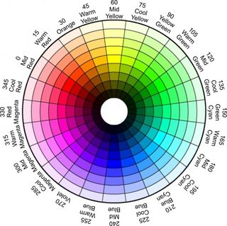

# Use your webcam and voice as a mouse!
This software is for all the people that are tired of using conventional items such as mice.

If you're scared of those strange objects, say no more and greet the future.

Find an object with a uniform color, clear your throat and prepare yourself.


# How to install
Just clone the repo and run ```pip install -r requirements.txt```.

I recommend using a virtual environment.


# Functionalities
Move your cursor by hovering an object in front of your webcam.

Produce a sufficiently loud enough to press a mouse button: you'll left click if its frequency is under 1500 Hz, right click otherwise.


# *Caveat*
I coded the program to recognise a yellow tennis ball. Should you want a different colour to be recognised,
you just have to uncomment ```webcam_reader.calibrate_hue(frame)``` and play with the hue thresholds.

I've used the **HSV color representation**, because in my experience I've always found it the easiest to work with, when it comes to recognise colours.


<p align="center>
    
    <em>Hue wheel</em>
</p>


Results highly depend on the illumination of the environment - it won't work in pitch darkness, and neither will it on the surface of the Sun - and the webcam quality as well.


# Future work
Easier parameters customization.
Better object recognition and outlier identification.
